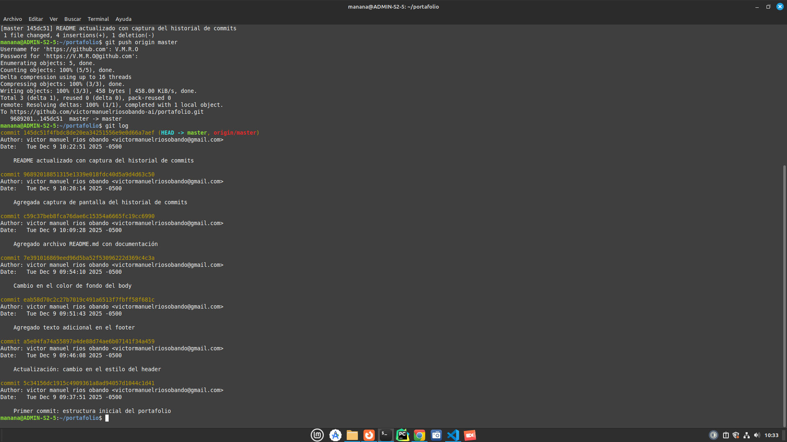

}
# Hoja de Vida - Victor Manuel Rios Obando

Este proyecto es una página web sencilla que presenta mi hoja de vida en formato digital.  
Incluye información personal, perfil, experiencia, educación y habilidades, con un diseño limpio y responsivo.

---

## 📂 Estructura del proyecto


portafolio/ ├── index.html # Página principal con la hoja de vida ├── style.css # Estilos CSS para darle formato y diseño ├── avatar.jpeg # Imagen de perfil (avatar) └── README.md # Documentación del proyecto

---

## 🚀 Cómo ejecutar el proyecto

1. Clonar el repositorio o copiar los archivos en tu máquina:
   ```bash
   git clone https://github.com/usuario/hoja-de-vida.git
   cd hoja-de-vida

2. Abrir el archivo `index.html` en cualquier navegador web.

3. (Opcional) Si usas **Visual Studio Code**, instala la extensión **Live Server** para ver los cambios en tiempo real:
   - Haz clic derecho en `index.html` → **Open with Live Server**.

---

## 🎨 Tecnologías utilizadas

- **HTML5** → estructura del contenido.  
- **CSS3** → estilos y diseño visual.  

---

## 📸 Captura de pantalla

## 📸 Captura de pantalla




---

## ✨ Autor

**Victor Manuel Rios Obando**  
📍 Medellín, Colombia  
📧 victormanuelriosobando@gmail.com  
📱 +57 304 470 9898
